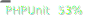
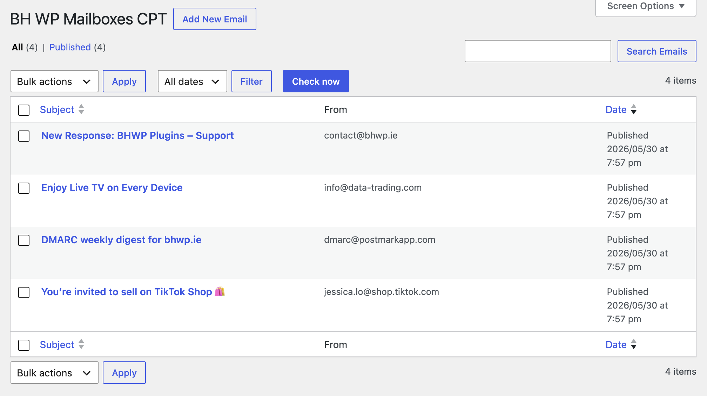

[](https://wordpress.org/plugins/bh-wp-mailboxes) [](https://github.com/WordPress-Coding-Standards/WordPress-Coding-Standards) [](https://brianhenryie.github.io/bh-wp-mailboxes/) 

# BH WP Mailboxes

A library to download emails into WordPress plugins.

e.g.
* Order payment receipts (Zelle, Venmo etc.)
* Newsletter unsubscribe emails
* Helpdesk
* Post by email 

A plugin user should be able to configure an inbox in the plugin settings, the library will download emails on a cron schedule, the library will filter emails to a predicate (e.g. only emails sent by @venmo.com, or a negative filter excluding known irrelevant subjects), the emails are saved to log, then the library fires an action for each new email downloaded. The parent plugin listens for that and acts appropriately, e.g. processes an unsubscribe request, creates a helpdesk ticket, etc.

[]

The core library this is built around is [zbateson/mail-mime-parser](https://github.com/zbateson/mail-mime-parser) – [mail-mime-parser.org](https://mail-mime-parser.org/).

TODO: we should annotate PhpDoc with RFCs relevant to the functions. 

## Goals

* Handle bad credentials – servers block IPs that have too many bad login attempts, so delay a few hours after each failed attempt, admin_notice to alert admins of problem (warning -> error)
* Support multiple mailboxes
* Save emails to cpt after filtering
* Autodelete email cpts locally.
* Optionally delete emails from the server after downloading (some email services are still size limited).
* Handle delayed emails. Maybe emails would only be delayed if the IMAP server is down. I just know email has an auto-retry mechanism to keep trying until delivered / 48 hours.

It's almost supposed to be a log of emails fetched whose data is used in plugins, for debugging when downloaded emails don't trigger plugins as expected, e.g. regex no longer matches after email body changes.

## Anti-goals:

* User-facing UI – the WP_List_Table (conventional, extensible) UI is intended for debugging, to allow site admins (shop managers etc.) to see the original emails and to test account settings etc.
* Sending email – use WP core functions for that, i.e. `wp_mail()` with an SMTP plugin. I recommend sending via AWS SES using WP SES plugin

## Implementation

Your implementation first needs the `BH_WP_Mailboxes_Settings_Interface` configuration which sets the custom post type names that mailboxes and emails are saved to, and the cron schedules mailboxes will be checked on. 

Somewhere in your plugin's settings you'll want to add a section for email account settings, e.g. IMAP server, username, password, etc. Some settings will probably be configured by you as a plugin developer, e.g. the number of days before emails are deleted. 

`API::save_new_mailbox()`

Saved mailboxes are checked on a cron job for new emails. When a new email is downloaded, the library fires an action that you can listen for. Use your own filters there and save the important information. 


// where do credentials get saved? wp_options should be discouraged but possible.
// maybe the account details get saved to cpt and a filter is used to supply the credentials object. I.e. the library stores everything except sensitive credentials
// ENV variable names need to be customisable.  


## CLI

What might be useful CLI commands?
`wp my-plugin mailboxes-group list` – shows configured email accounts, last checked time, number of current messages.
`wp my-plugin mailboxes-group fetch` – fetch emails for all configured accounts
`wp my-plugin mailboxes-group fetch --since 2026-06-01` – fetch emails and override saved last checked time.
`wp my-plugin mailboxes-group fetch brianhenryie@gmail.com` fetch for specific account

Should we keep a historic count of emails fetched?
The Email_Account cpt will store when it first was added.
Once a email_account is created, its address can never be changed.

## Privacy / GDPR

The default setting is to delete emails after 7 days. NB: if you're using a shared inbox for your plugin's purpose (e.g. Venmo receipt emails go to treasurer@company.com rather than payments@company.com) this library will download _all_ emails. You can immediately delete all emails that you know are not relevant, but that is not the default. Emails that are downloaded are saved for debugging, e.g. the format of the Venmo emails changes and regexes that used to work to extract the relevant data no longer work, so you can see the original email in the WP List Table UI. Be aware of this and inform your company's data controller. I am not a lawyer, but I think this is ok! 

## Extensibility

<!-- filters -->
// TODO: implement and document filters.
// TODO: find a tool that documents filters and actions in the codebase. Then create a github action that updates the README with that output.
<!-- /filters -->

### Google API client

There is code in the plugin to support Google Developer Console projects but the Composer dependency is not included by default. If you want to use that:

```
{
    "require": {
        "google/apiclient": "^2.12.1"
    },
    "scripts": {
        "pre-autoload-dump": ["Google\\Task\\Composer::cleanup"]
    },
    "extra": {
        "google/apiclient-services": [
            "Gmail"        
        ]
    }
}
```

```bash
jq '.scripts["pre-autoload-dump"] |= ((. // []) + ["Google\\Task\\Composer::cleanup"]) | unique' composer.json | sponge composer.json
jq '.extra["google/apiclient-services"] |= ((. // []) + ["Gmail"]) | unique' composer.json | sponge composer.json
composer require google/apiclient
```

## Contributing

See [CONTRIBUTING.md](CONTRIBUTING.md) for details on contributing to the project. It's easy.

## TODO:

* AWS SES inbound SMTP via SNS
* What Cloudflare incoming email features are there these days? I think they need a CF worker to accept the email then send a HTTP request to your server.
* All exceptions should be caught and displayed as admin_notices, never thrown (never expect the plugin developer to handle exceptions from the library).

### More Information

See [github.com/BrianHenryIE/WordPress-Plugin-Boilerplate](https://github.com/BrianHenryIE/WordPress-Plugin-Boilerplate) for initial setup rationale. 

# Acknowledgements