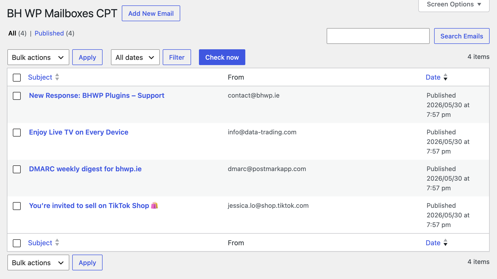
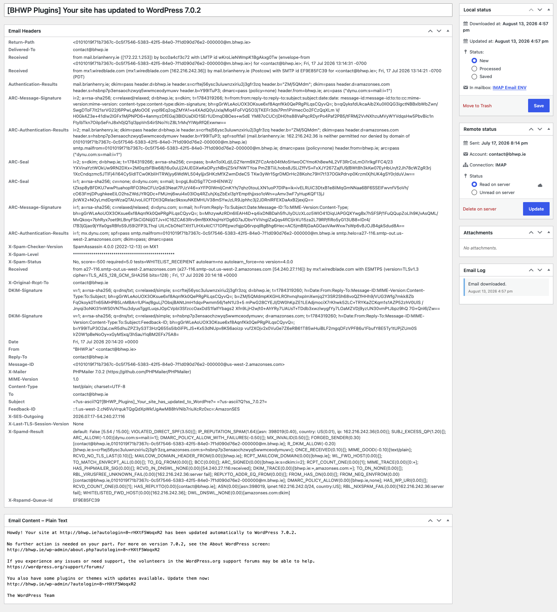

[](https://wordpress.org/plugins/bh-wp-mailboxes) [](https://github.com/WordPress-Coding-Standards/WordPress-Coding-Standards) [](https://brianhenryie.github.io/bh-wp-mailboxes/) 

# BH WP Mailboxes

A library to download emails into WordPress plugins.

e.g.
* Order payment receipts (Zelle, Venmo etc.)
* Newsletter unsubscribe emails
* Helpdesk
* Post by email 

A plugin user should be able to configure an inbox in the plugin settings, the library will download emails on a cron schedule, the library will filter emails to a predicate (e.g. only emails sent by @venmo.com, or a negative filter excluding known irrelevant subjects), the emails are saved to log, then the library fires an action for each new email downloaded. The parent plugin listens for that and acts appropriately, e.g. processes an unsubscribe request, creates a helpdesk ticket, etc.





The core library this is built around is [zbateson/mail-mime-parser](https://github.com/zbateson/mail-mime-parser) – [mail-mime-parser.org](https://mail-mime-parser.org/).

## Goals

* Handle bad credentials – servers block IPs that have too many bad login attempts, so delay a few hours after each failed attempt, admin_notice to alert admins of problem (warning -> error)
* Support multiple mailboxes
* Save emails to cpt after filtering
* Autodelete email cpts locally.
* Optionally delete emails from the server after downloading (some email services are still size limited).
* Handle delayed emails. Maybe emails would only be delayed if the IMAP server is down. I just know email has an auto-retry mechanism to keep trying until delivered / 48 hours.

It's almost supposed to be a log of emails fetched whose data is used in plugins, for debugging when downloaded emails don't trigger plugins as expected, e.g. regex no longer matches after email body changes.

### Anti-goals:

* User-facing UI – the WP_List_Table (conventional, extensible) UI is intended for debugging, to allow site admins (shop managers etc.) to see the original emails and to test account settings etc.
* Sending email – use WP core functions for that, i.e. `wp_mail()` with an SMTP plugin. I recommend sending via AWS SES using WP SES plugin

## Implementation

Your implementation first needs the `BH_WP_Mailboxes_Settings_Interface` configuration which sets the custom post type names that mailboxes and emails are saved to, and the cron schedules mailboxes will be checked on. 

`$mailboxes = BH_WP_Mailboxes::make( $mailboxes_settings, $this->logger );`

Somewhere in your plugin's settings you'll want to add a section for email account settings, e.g. IMAP server, username, password, etc. Some settings will probably be configured by you as a plugin developer, e.g. the number of days before emails are deleted. 

Using `API::save_new_mailbox()`, save the account configuration to a `wp_post`. When saving you will set the `connection_type_class`, e.g. `ImapEngine_Imap_Email_Connection`

Add a filter on `bh_wp_mailboxes_credentials` to provide the credentials (this allows abstracting credential storage from the library)

Saved mailboxes are checked on a cron job for new emails. When a new email is downloaded, the library fires `bh_wp_mailboxes_new_email` for you to listen for.  
Use the methods on `New_Email_Interface` to read the email, log any action taken, and maybe mark it to be saved 

## Connection Types

### IMAP

`IMAP_Credentials_Interface` requires the server, username, password, and encryption type. Port defaults to 143 or 993 depending on encryption and can be overridden by specifying it with the server name. 
An `Imap_Credentials_Env` class exists that reads from environmental variables `IMAP_SERVER`, `IMAP_USERNAME`, `IMAP_PASSWORD`, `IMAP_ENCRYPTION`, and those env variable names can be specified in the constructor.  

### Cloudflare Email Routing

A Cloudflare Worker is available that forwards all mail received to a WordPress REST endpoint (`example.com/wp-json/.../email-cpt/new`).
Enable the REST endpoint by setting `BH_WP_Mailboxes_Settings_Interface::get_rest_namespace()`.
Install the Worker with:

[](https://deploy.workers.cloudflare.com/?url=https://github.com/BrianHenryIE/bh-wp-mailboxes-cloudflare-worker)

Then visit the Worker URL provided when Cloudflare finishes installing. There you will:
1. Set a password for the Worker config page for future access
2. Enter the website URL for WordPress and "Continue to WordPress authorization" to grant the Worker an [Application Password](https://developer.wordpress.org/advanced-administration/security/application-passwords/).
3. Set a Cloudflare API token (unsaved) to configure a domain to forward emails to the Worker
4. Optionally set an email address to receive failure alerts

The main limit is that Cloudflare Email Routing must be enabled on the entire domain.

### Gmail

Gmail can use regular IMAP via application passwords when the account has 2FA enabled.

To use the Gmail API, see includes/connections/gmail-api/README-GMAIL.md for configuring a Google Developer Console project. I think supporting this in distributed plugins is probably too much work!

## WP-CLI

The library registers WP-CLI commands for each mailbox it's used to create. They are namespaced under that mailbox's *CLI base* — `BH_WP_Mailboxes_Settings_Interface::get_cli_base()`, which defaults to the plugin slug. Return `null` from `get_cli_base()` to disable registering CLI commands. Replace `<cli-base>` below with that value.

### `wp <cli-base> mailboxes list`

List every configured mailbox. A "mailbox" is one instance of the library — an emails post type plus its accounts post type — and may contain many email accounts. The row shows the slug, post-type names, friendly name, and account count. Unlike `accounts list` (which is scoped to one mailbox), this spans every registered mailbox.

```bash
wp <cli-base> mailboxes list [--format=<table|csv|json|yaml|count>]
```

### `wp <cli-base> accounts list`

List the email accounts configured for this mailbox — id, email, display name, connection, active state, and last-checked time.

```bash
wp <cli-base> accounts list [--format=<table|csv|json|yaml|count>]
```

## Privacy / GDPR

The default setting is to delete emails after 7 days. NB: if you're using a shared inbox for your plugin's purpose (e.g. Venmo receipt emails go to treasurer@company.com rather than payments@company.com) this library will download _all_ emails. You can immediately delete all emails that you know are not relevant, but that is not the default. Emails that are downloaded are saved for debugging, e.g. the format of the Venmo emails changes and regexes that used to work to extract the relevant data no longer work, so you can see the original email in the WP List Table UI. Be aware of this and inform your company's data controller. I am not a lawyer, but I think this is ok! 

## Extensibility

<!-- filters -->
// TODO: implement and document filters.

// TODO: find a tool that documents filters and actions in the codebase. Then create a github action that updates the README with that output.
<!-- /filters -->

## Contributing

See [CONTRIBUTING.md](CONTRIBUTING.md) for details on contributing to the project. It's easy.

## TODO:

* AWS SES inbound SMTP via SNS
* All exceptions should be caught and displayed as admin_notices, never thrown (never expect the plugin developer to handle exceptions from the library).

### More Information

See [github.com/BrianHenryIE/WordPress-Plugin-Boilerplate](https://github.com/BrianHenryIE/WordPress-Plugin-Boilerplate) for initial setup rationale. 

# Acknowledgements