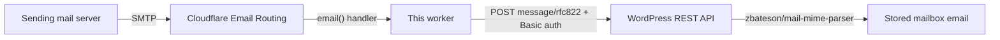

# bh-wp-mailboxes — Cloudflare incoming email worker

A Cloudflare Worker that receives email via [Cloudflare Email Routing](https://developers.cloudflare.com/email-service/get-started/route-emails/)
and delivers the raw MIME message, unmodified, to the WordPress REST API endpoint provided by
the bh-wp-mailboxes plugin. Mail to `anything@p.example.org` becomes a `POST` to
`https://example.org/wp-json/…/incoming-email`.

This directory lives inside the bh-wp-mailboxes plugin repository but is **deployed
independently** with Wrangler. See [PLAN.md](./PLAN.md) for the design decisions and the
worker ⇄ plugin ingress contract.

## How it works



- The recipient domain must share a registrable domain (eTLD+1) with the configured
  WordPress site; anything else is rejected with a permanent SMTP error.
- The endpoint is **discovered**, not hard-coded: `Link` header → `/wp-json/` index →
  `email_ingress_endpoints` key (namespace-agnostic), cached in KV.
- Authentication uses a WordPress application password obtained via the core
  authorization flow (`/setup` route below) and sent as HTTP Basic auth.
- On transient failure (site down, no credential yet) the handler throws, so the
  **sending** server retries. Oversized messages are rejected permanently.
- The email's `Message-ID` is the idempotency key; WordPress upserts on retries.

## Setup

1. Create the KV namespace and set the secret:

   ```sh
   npx wrangler kv namespace create WORKER_CONFIGURATION_KV   # put the id in wrangler.jsonc
   npx wrangler secret put SETUP_TOKEN                        # any long random string
   ```

2. Set `TARGET_WORDPRESS_SITE_URL` in `wrangler.jsonc`, then deploy:

   ```sh
   npx wrangler deploy
   ```

3. In the Cloudflare dashboard, enable Email Routing for the zone (and the subdomain, e.g.
   `p.example.org`, which needs its own MX records) and add a catch-all rule sending to this
   worker.

4. Authorize against WordPress (requires the bh-wp-mailboxes plugin active on the site and
   an HTTPS site): visit

   ```
   https://<worker-host>/setup?token=<SETUP_TOKEN>
   ```

   log in as the dedicated low-privilege WordPress user created for email ingress, and
   approve. The credential is stored in KV; the confirmation page never displays it.

## Configuration reference

| Name                        | Kind         | Purpose                                                            |
| --------------------------- | ------------ | ------------------------------------------------------------------ |
| `TARGET_WORDPRESS_SITE_URL` | env var      | Base URL of the WordPress site (e.g. `https://sacramentogaa.org`). |
| `SETUP_TOKEN`               | secret       | Gates the `/setup` and `/setup/callback` routes.                   |
| `WORKER_CONFIGURATION_KV`   | KV namespace | Discovered endpoint cache + application-password credential.       |

## Development

```sh
npm install
npm run check     # lint (ESLint + Prettier) + typecheck + unit tests — must pass before every commit
```

### Testing tiers

**1. Unit tests (every change, CI):**

```sh
npm run test
```

Fixtures live in `tests/fixtures/*.eml` (raw RFC 5322, CRLF line endings, must include a
`Message-ID` header). Add a fixture for any new message shape you handle.

**2. Local integration (no email infrastructure):**

```sh
npx wrangler dev
scripts/send-fixture-local.sh tests/fixtures/plain-text-simple.eml
```

This POSTs the fixture to `wrangler dev`'s simulated email endpoint
(`/cdn-cgi/handler/email`). Point `TARGET_WORDPRESS_SITE_URL` at a local WordPress
(`http://localhost:…` is allowed and skips the https/domain checks) to exercise the whole
pipeline on one machine.

No local WordPress? `scripts/fake-wordpress-ingress-server.mjs` fakes the WordPress side of
the contract (REST index discovery + ingress endpoint) and saves each received message to
`received-emails/<n>.eml` so it can be diffed against the fixture:

```sh
node scripts/fake-wordpress-ingress-server.mjs                    # port 8899
echo 'TARGET_WORDPRESS_SITE_URL=http://localhost:8899' >  .dev.vars
echo 'SETUP_TOKEN=local-dev-token'                     >> .dev.vars
npx wrangler dev
curl 'http://localhost:8787/setup/callback?token=local-dev-token&site_url=http%3A%2F%2Flocalhost%3A8899&user_login=test&password=test'
scripts/send-fixture-local.sh tests/fixtures/plain-text-simple.eml
diff tests/fixtures/plain-text-simple.eml received-emails/1.eml   # byte-for-byte
```

**3. Live test (deployed worker, real email):**

```sh
scripts/send-fixture-live.sh tests/fixtures/plain-text-simple.eml mailbox@p.sacramentogaa.org
npx wrangler tail                                             # watch the worker logs
scripts/verify-delivery.sh '<plain-text-simple-fixture@bh-wp-mailboxes.test>'
```

`send-fixture-live.sh` sends the fixture through an authenticated SMTP relay using
[swaks](https://github.com/jetmore/swaks) (`brew install swaks`). Note: relays rewrite some
headers (`From:`, DKIM), so live tests validate the pipeline; byte-exact MIME handling is
covered by tiers 1–2. There is no usable command-line interface to macOS Mail.app for
sending a raw `.eml` verbatim — use swaks.

`verify-delivery.sh` polls the WordPress REST API for the fixture's `Message-ID` and exits
non-zero on timeout, so it can gate scripts.

## Pull requests

Every PR touching this directory should include: unit tests for the change, a screenshot
(e.g. `wrangler tail` output, the WordPress admin screen showing the stored email), and the
manual live-test commands run with their result. CI runs `npm run check` via
`.github/workflows/cloudflare-worker.yml`.
